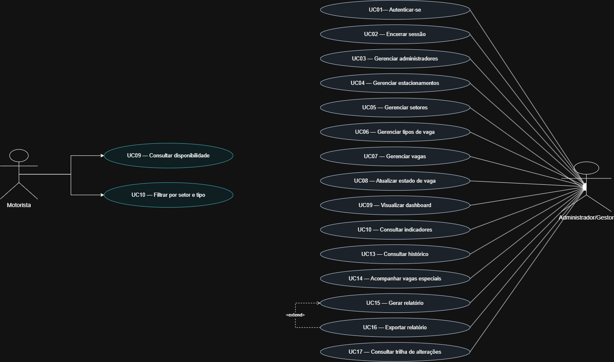
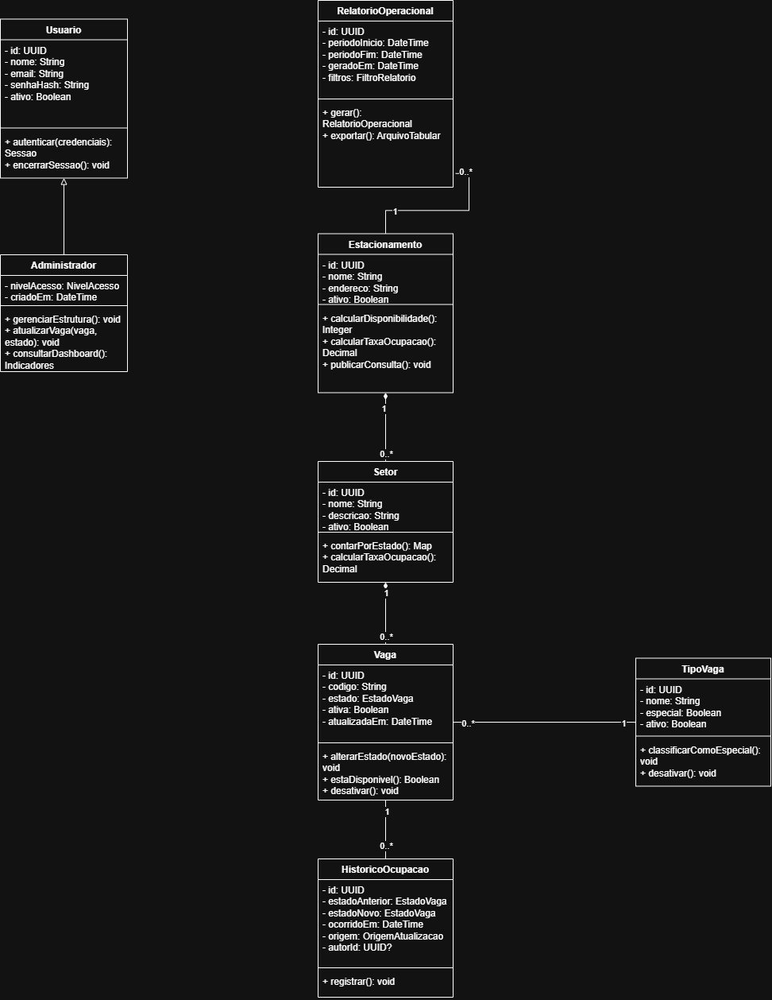

# ParkFlow

> **Sistema Inteligente de Gestão de Estacionamentos**
> *Encontre. Estacione. Siga.*

O ParkFlow é uma proposta de plataforma web para gestão e inteligência operacional de estacionamentos. Esta entrega reúne a concepção, os requisitos, a modelagem UML, a identidade visual, o pitch e o planejamento acadêmico da Parte 1; ainda não há software funcional.

## Sobre

Estacionamentos de grande circulação precisam conciliar duas experiências: o motorista quer encontrar uma vaga com menos circulação desnecessária, enquanto o gestor precisa compreender a ocupação e tomar decisões operacionais com dados consistentes. O ParkFlow organiza essas necessidades em uma única proposta de produto.

## Problema

A procura manual por vagas pode aumentar o tempo de circulação interna e dificultar a experiência do motorista. Paralelamente, a ausência de uma visão centralizada limita o acompanhamento de vagas disponíveis, setores mais utilizados, horários de maior movimento, vagas especiais e histórico de ocupação.

Leia a [descrição completa do problema](docs/requisitos/problema.md).

## Solução

O ParkFlow propõe uma aplicação web responsiva que consolida o cadastro e o estado das vagas, apresenta disponibilidade ao motorista e oferece ao gestor dashboard, histórico, indicadores e relatórios operacionais básicos. A previsão de ocupação é uma possibilidade futura condicionada à existência de dados históricos suficientes; não faz parte do MVP.

## Público-alvo

- **Clientes e compradores:** shopping centers, universidades, hospitais, empresas, condomínios e operadores de estacionamentos.
- **Usuários finais:** motoristas que consultam disponibilidade e gestores responsáveis pela operação.

Consulte [público-alvo](docs/requisitos/publico-alvo.md) e [personas](docs/requisitos/personas.md).

## Funcionalidades do MVP

- autenticação e gestão de acesso dos administradores;
- cadastro de estacionamentos, setores, tipos de vaga e vagas;
- atualização e consulta do estado operacional das vagas;
- consulta pública de disponibilidade por estacionamento e setor;
- dashboard gerencial com ocupação atual;
- histórico, indicadores e relatórios operacionais básicos;
- registro de alterações relevantes para auditoria.

Os detalhes estão nos [requisitos funcionais](docs/requisitos/requisitos-funcionais.md), [requisitos não funcionais](docs/requisitos/requisitos-nao-funcionais.md) e [regras de negócio](docs/requisitos/regras-de-negocio.md).

## Diferenciais planejados

- visão de disponibilidade voltada tanto ao motorista quanto ao gestor;
- gestão centralizada de múltiplos setores e estacionamentos autorizados;
- histórico estruturado para apoiar análise operacional;
- base arquitetural preparada para futuras integrações;
- possibilidade futura de previsão de ocupação baseada em dados históricos validados.

Esses diferenciais não transformam funcionalidades futuras em obrigações do MVP. Veja o [escopo](docs/requisitos/escopo.md).

## UML

Os modelos são arquivos XML editáveis no diagrams.net/draw.io:

- [Diagrama de Casos de Uso](docs/uml/diagrama-casos-de-uso.drawio)
- [Diagrama de Classes](docs/uml/diagrama-classes.drawio)
- [Decisões de modelagem](docs/uml/README.md)
- [Matriz de rastreabilidade](docs/uml/matriz-rastreabilidade.md)

### Diagrama de Casos de Uso



### Diagrama de Classes



Os arquivos `.drawio` acima permanecem como as versões editáveis e rastreáveis dos diagramas.

## Identidade visual

A marca combina mobilidade, tecnologia, eficiência e segurança em uma linguagem B2B. A identidade usa azul profundo como base e ciano como destaque, com estados operacionais acompanhados por texto e símbolos para preservar a acessibilidade.

- [Guia de identidade visual](docs/marca/identidade-visual.md)
- [Logo principal](assets/logo/parkflow-logo.svg)
- [Símbolo reduzido](assets/logo/parkflow-simbolo.svg)

## Estrutura do projeto

```text
.
├── assets/              # Logo e espaço para imagens futuras
├── backend/             # Área reservada para etapas futuras
├── database/            # Área reservada para etapas futuras
├── docs/
│   ├── marca/           # Identidade visual
│   ├── pitch/           # Proposta de valor e pitch de 1 minuto
│   ├── planejamento/    # Trello, backlog e roadmap
│   ├── requisitos/      # Problema, públicos, escopo e requisitos
│   ├── superpowers/     # Especificação e plano de execução aprovados
│   └── uml/             # Diagramas e rastreabilidade
├── frontend/            # Área reservada para etapas futuras
├── scripts/             # Validação automatizada da entrega
├── .gitignore
├── LICENSE
└── README.md
```

## Documentação

| Área | Documento principal |
|---|---|
| Problema e objetivos | [Problema](docs/requisitos/problema.md) · [Objetivos](docs/requisitos/objetivos.md) |
| Requisitos | [RFs](docs/requisitos/requisitos-funcionais.md) · [RNFs](docs/requisitos/requisitos-nao-funcionais.md) · [Regras](docs/requisitos/regras-de-negocio.md) |
| Escopo | [MVP, exclusões e evoluções](docs/requisitos/escopo.md) |
| UML | [Guia dos diagramas](docs/uml/README.md) |
| Marca | [Identidade visual](docs/marca/identidade-visual.md) |
| Pitch | [Proposta de valor](docs/pitch/proposta-de-valor.md) · [Pitch de 1 minuto](docs/pitch/pitch-1-minuto.md) |
| Planejamento | [Trello](docs/planejamento/trello.md) · [Backlog](docs/planejamento/backlog.md) · [Roadmap](docs/planejamento/roadmap.md) |
| Qualidade | [Auditoria da entrega](docs/AUDITORIA-ENTREGA.md) |

## Roadmap

- **Parte 1 — atual:** concepção, requisitos, UML, marca, pitch e planejamento.
- **Parte 2 — sugestão:** preparação técnica e desenvolvimento inicial, após confirmação das orientações acadêmicas.
- **Parte 3 — sugestão:** evolução, integração, validação e apresentação final, também sujeitas às orientações da disciplina.

Detalhes em [roadmap](docs/planejamento/roadmap.md).

## Organização da equipe

Enquanto a composição da equipe não for informada, o planejamento usa os placeholders `[Membro 1]`, `[Membro 2]`, `[Membro 3]` e `[Membro 4]`. A atribuição real deve ser feita pelo grupo no quadro Trello.

## Apresentação e gestão do projeto

- [Vídeo pitch do ParkFlow](https://youtu.be/lwHYLGr9wz8)
- [Vídeo pitch e apresentação do projeto](https://youtu.be/PiDqdw2yZ7Q)
- [Quadro do ParkFlow no Trello](https://trello.com/invite/b/6a9779afc06e67580b01f7d2/ATTI7d90a07a7bab493777a42f626d428ddd713726CD/parkflow)

Os vídeos e o quadro são entregas externas. O roteiro completo do vídeo não é armazenado neste repositório.

## Tecnologias consideradas para as próximas etapas

| Área | Opção considerada | Situação |
|---|---|---|
| Frontend | React | Em avaliação |
| Backend | Python com FastAPI | Em avaliação |
| Banco de dados | PostgreSQL | Em avaliação |
| Prototipação | Figma | Em avaliação |
| Modelagem | diagrams.net/draw.io | Adotado na Parte 1 |
| Versionamento | Git e GitHub | Adotado para organização |
| Gestão | Trello | Quadro criado e vinculado |

A stack de implementação poderá ser revisada antes da Parte 2.

## Status

**Parte 1 — documentação e modelagem.** Nenhum frontend, backend, banco de dados ou API funcional foi desenvolvido.

## Equipe

Composição ainda não informada. Não foram atribuídos nomes fictícios.

## Licença

Este projeto está disponibilizado sob a [Licença MIT](LICENSE).
