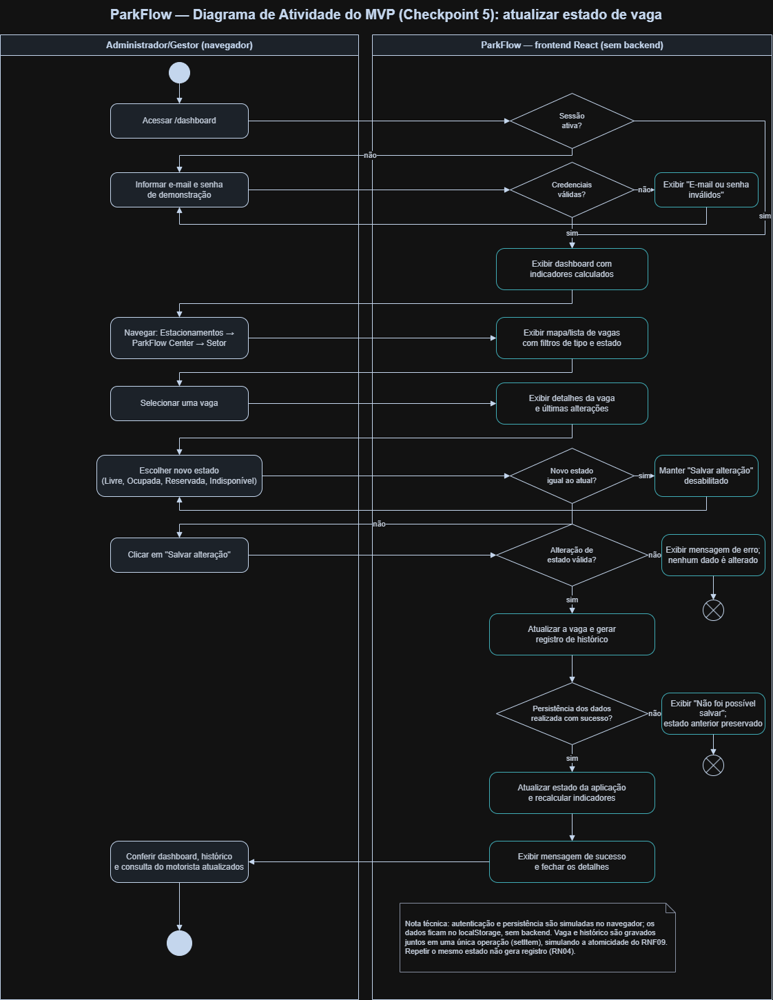
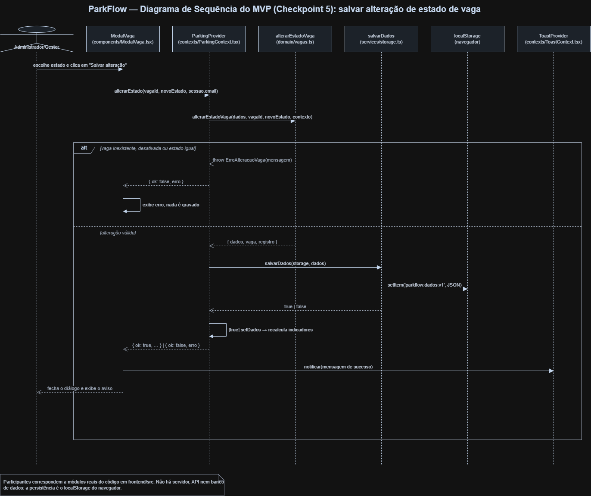

# ParkFlow

> **Sistema Inteligente de Gestão de Estacionamentos**
> *Encontre. Estacione. Siga.*

## Sobre

O ParkFlow é uma plataforma web para gestão e inteligência operacional de estacionamentos. O motorista quer encontrar uma vaga com menos circulação; o gestor precisa acompanhar ocupação, setores, vagas especiais e histórico com dados consistentes.

A **Parte 1** reuniu concepção, requisitos, UML, identidade visual, pitch e planejamento. O **Checkpoint 5** acrescenta um **MVP funcional** que demonstra os fluxos centrais com dados fictícios salvos no navegador.

- [Problema](docs/requisitos/problema.md) · [Objetivos](docs/requisitos/objetivos.md) · [Público-alvo](docs/requisitos/publico-alvo.md) · [Personas](docs/requisitos/personas.md)

## Checkpoint 5 — MVP

| Item | Situação |
|---|---|
| Interface web (React + TypeScript + Vite) | Implementada em [`frontend/`](frontend/README.md) |
| Fluxo login → dashboard → setor → vaga → alteração → histórico → indicadores → consulta | Funcional no navegador |
| Regras de disponibilidade, ocupação e histórico | Implementadas e cobertas por testes automatizados |
| Autenticação | **Simulada** no navegador (sem servidor, hash ou token) |
| Persistência | `localStorage` do navegador; sem backend nem banco de dados |
| Estados das vagas | Dados fictícios alterados manualmente; não há sensores |

O status de cada requisito está em [status de implementação](docs/checkpoint-5/status-implementacao.md).

## Funcionalidades

- **Login e logout simulados**, com validação, mensagem de erro, sessão persistida e retorno à rota pedida.
- **Dashboard** com total, disponíveis, ocupadas, reservadas, indisponíveis e taxa de ocupação; gráfico de ocupação por setor (com tabela acessível); cartões por setor; vagas especiais (PCD e Idoso); atividade recente.
- **Estacionamentos → setores → vagas**, com mapa ou lista, filtros por tipo e estado e detalhe da vaga em diálogo.
- **Alteração de estado** (Livre, Ocupada, Reservada, Indisponível) com registro no histórico e aviso de sucesso. Escolher o mesmo estado não gera registro.
- **Consulta de vagas** pública (sem login) por estacionamento, setor e tipo, usando os mesmos dados do painel.
- **Histórico** somente leitura, do mais recente ao mais antigo, com filtros por busca (vaga ou responsável), setor, tipo, estado e período.
- **Relatórios** com filtros de período, estacionamento, setor e tipo, distribuição por setor e por tipo e **exportação CSV**.
- **Restaurar dados de demonstração**, com confirmação, no menu do usuário.

## Tecnologias

| Área | Tecnologia |
|---|---|
| Interface | React 19, TypeScript, Vite, React Router |
| Ícones e fonte | lucide-react, Inter (`@fontsource-variable/inter`) |
| Estilos | CSS com variáveis da marca, sem framework |
| Testes e qualidade | Vitest, ESLint (typescript-eslint, React Hooks) |
| Modelagem | diagrams.net/draw.io |
| Gestão | Git, GitHub e Trello |

Gráficos são desenhados com CSS próprio; não há biblioteca de gráficos, datas ou componentes visuais.

## Arquitetura do MVP

```text
frontend/src/
├── domain/      # funções puras: indicadores, vagas, filtros, relatório, CSV, datas
├── data/        # seed determinístico de demonstração
├── services/    # único acesso ao localStorage e autenticação simulada
├── contexts/    # AuthContext, ParkingContext e ToastContext
├── layouts/     # área administrativa, área pública e menu do usuário
├── components/  # componentes reutilizáveis (estado, gráfico, diálogo, cartões)
├── pages/       # uma página por rota
└── styles/      # tokens da marca e CSS
```

- Todas as telas leem a mesma fonte de dados (`ParkingContext`); os indicadores são derivados das vagas e nunca armazenados.
- As regras de cálculo ficam em [`frontend/src/domain/indicadores.ts`](frontend/src/domain/indicadores.ts):
  - **disponível:** vaga ativa e `LIVRE` (RN06);
  - **operacional:** vaga ativa que não está `INDISPONIVEL`;
  - **taxa de ocupação:** `(ocupadas + reservadas) ÷ operacionais × 100` (RN07); sem vaga operacional, “não aplicável”.
- Rotas, armazenamento e decisões estão em [`frontend/README.md`](frontend/README.md).

## Dados mockados

- Estacionamento **ParkFlow Center**, São Paulo - SP.
- Setores **A (Térreo)**, **B (Piso 1)** e **C (Subsolo)**, com 20 vagas cada (códigos A01 a C20).
- Tipos Comum, PCD, Idoso, Elétrica e Moto; PCD e Idoso são especiais.
- Ocupação inicial diferente por setor (cerca de 56%, 76% e 33%) e 10 movimentações iniciais.
- A geração é determinística ([`frontend/src/data/seed.ts`](frontend/src/data/seed.ts)): sempre as mesmas vagas e estados. A vaga **A01** começa livre, para a demonstração.
- `RESERVADA` é um estado definido manualmente pelo gestor; não existe fluxo de reserva.

## Credenciais de demonstração

E-mail: `admin@parkflow.com`

Senha: `123456`

O acesso é **simulado** e serve apenas para a demonstração acadêmica. A consulta de vagas (`/consulta`) não exige login.

## Como executar

### Pré-requisitos

- [Node.js](https://nodejs.org/) **22.12 ou superior** (inclui o npm);
- um navegador atualizado.

Não é necessário backend, banco de dados, Docker, arquivo `.env` ou conta externa.

### Instalação

Na raiz do repositório:

```bash
npm install
```

### Execução

```bash
npm run dev
```

Abra o endereço exibido no terminal (normalmente `http://localhost:5173`).

## Build

```bash
npm run build
```

O build de produção é gerado em `frontend/dist` e pode ser servido com:

```bash
npm run preview
```

Outros comandos:

| Comando | O que faz |
|---|---|
| `npm test` | testes automatizados (Vitest) |
| `npm run lint` | análise estática (ESLint) |

A raiz usa *npm workspaces*: os comandos delegam para o pacote `frontend`.

## Como testar o fluxo principal

1. Fazer login com a credencial de demonstração.
2. Visualizar o **Dashboard** e anotar disponíveis, ocupadas e taxa.
3. Abrir **Estacionamentos**.
4. Em **ParkFlow Center**, clicar em **Visualizar setores**.
5. Entrar no **Setor A**.
6. Selecionar a vaga livre **A01**.
7. Escolher **Ocupada**.
8. Clicar em **Salvar alteração**.
9. Conferir o aviso de sucesso e a vaga A01 marcada como ocupada.
10. Abrir **Histórico**.
11. Confirmar o novo registro de A01 (Livre → Ocupada) no topo.
12. Voltar ao **Dashboard**.
13. Confirmar uma vaga disponível a menos, uma ocupada a mais e a taxa recalculada.
14. Abrir **Consulta de vagas**.
15. Confirmar a disponibilidade atualizada no Setor A.
16. Abrir **Relatórios**, gerar o relatório e, se quiser, exportar o CSV.

As alterações permanecem após recarregar a página.

## Reset dos dados

No canto superior direito, abra o menu do administrador e escolha **Restaurar dados de demonstração**. Após a confirmação, as 60 vagas e o histórico voltam à situação inicial, e todas as telas são recalculadas; a sessão continua ativa. Limpar os dados do site no navegador tem o mesmo efeito no próximo acesso.

Se os dados salvos estiverem corrompidos ou forem de outra versão, o sistema recarrega a demonstração automaticamente e exibe um aviso.

## Documentação

| Área | Documento principal |
|---|---|
| Checkpoint 5 | [Status de implementação](docs/checkpoint-5/status-implementacao.md) · [Auditoria](docs/checkpoint-5/auditoria-checkpoint-5.md) · [Frontend](frontend/README.md) |
| Requisitos | [RFs](docs/requisitos/requisitos-funcionais.md) · [RNFs](docs/requisitos/requisitos-nao-funcionais.md) · [Regras](docs/requisitos/regras-de-negocio.md) — cada item com “Status no Checkpoint 5” |
| Escopo | [MVP, Checkpoint 5, exclusões e evoluções](docs/requisitos/escopo.md) |
| Marca | [Identidade visual](docs/marca/identidade-visual.md) · [Logo](assets/logo/parkflow-logo.svg) · [Símbolo](assets/logo/parkflow-simbolo.svg) |
| Pitch | [Proposta de valor](docs/pitch/proposta-de-valor.md) |
| Planejamento | [Trello](docs/planejamento/trello.md) · [Backlog](docs/planejamento/backlog.md) · [Roadmap](docs/planejamento/roadmap.md) |
| Qualidade | [Auditoria da Parte 1](docs/AUDITORIA-ENTREGA.md) · [Auditoria do Checkpoint 5](docs/checkpoint-5/auditoria-checkpoint-5.md) |

A estrutura documental e os diagramas podem ser verificados com:

```powershell
powershell -ExecutionPolicy Bypass -File scripts/validar-entrega.ps1
```

### Estrutura do projeto

```text
.
├── assets/              # Logo e imagens dos diagramas
├── backend/             # Área reservada (sem backend no Checkpoint 5)
├── database/            # Área reservada (sem banco no Checkpoint 5)
├── docs/
│   ├── checkpoint-5/    # Status de implementação e auditoria do MVP
│   ├── marca/           # Identidade visual
│   ├── pitch/           # Proposta de valor e pitch
│   ├── planejamento/    # Trello, backlog e roadmap
│   ├── requisitos/      # Problema, públicos, escopo e requisitos
│   ├── superpowers/     # Especificação e plano da Parte 1
│   └── uml/             # Diagramas e rastreabilidade
├── frontend/            # MVP funcional (React + TypeScript + Vite)
├── scripts/             # Validação automatizada da entrega
├── package.json         # Workspaces npm e scripts da raiz
└── README.md
```

## UML

Arquivos XML editáveis no diagrams.net/draw.io:

- [Diagrama de Atividade do MVP](docs/uml/diagrama-atividade-mvp.drawio) — Checkpoint 5: fluxo real de login, navegação e alteração de estado.
- [Diagrama de Sequência do MVP](docs/uml/diagrama-sequencia-mvp.drawio) — Checkpoint 5: mensagens entre os módulos reais do frontend ao salvar uma alteração.
- [Diagrama de Casos de Uso](docs/uml/diagrama-casos-de-uso.drawio) — Parte 1.
- [Diagrama de Classes](docs/uml/diagrama-classes.drawio) — Parte 1.
- [Decisões de modelagem](docs/uml/README.md) · [Matriz de rastreabilidade](docs/uml/matriz-rastreabilidade.md)

### Diagrama de Casos de Uso


### Diagrama de Classes


### Diagrama de Atividade do MVP



### Diagrama de Sequência do MVP



## Limitações

- **Autenticação simulada:** a credencial é pública e verificada no próprio navegador; não representa uma solução de produção.
- **Dados fictícios:** os estados das vagas são de demonstração e alterados manualmente.
- **`localStorage`:** os dados ficam apenas no navegador usado e servem somente para a demonstração.
- Não há backend, API, banco de dados nem implantação.
- Estacionamentos, setores, tipos e vagas são fixos; não há cadastro, edição ou desativação pela interface.
- Gestão de administradores (RF03), trilha administrativa (RF17) e restrição por escopo (RF18) não foram implementadas.
- O relatório não calcula taxa histórica por período e não exporta PDF.
- Não foram executados testes de carga, matriz de navegadores, testes com usuários nem ferramenta automatizada de acessibilidade.

O objetivo atual é validar a experiência e o fluxo funcional.

## Evoluções futuras

- backend com persistência real e autenticação segura;
- cadastro e desativação lógica de estacionamentos, setores, tipos e vagas;
- gestão de administradores, trilha de alterações e restrição por escopo;
- indicadores históricos por período;
- integrações com sensores, cancelas e leitura de placas, após avaliação técnica e de privacidade;
- previsão de ocupação, somente com histórico suficiente e confiável.

Detalhes em [roadmap](docs/planejamento/roadmap.md), [backlog](docs/planejamento/backlog.md) e [escopo](docs/requisitos/escopo.md).

## Apresentação e gestão do projeto

- [Vídeo pitch do ParkFlow](https://youtu.be/lwHYLGr9wz8)
- [Vídeo pitch e apresentação do projeto](https://youtu.be/PiDqdw2yZ7Q)
- [Quadro do ParkFlow no Trello](https://trello.com/invite/b/6a9779afc06e67580b01f7d2/ATTI7d90a07a7bab493777a42f626d428ddd713726CD/parkflow)

Os vídeos e o quadro são entregas externas. O roteiro completo do vídeo não é armazenado neste repositório.

## Licença

Este projeto está disponibilizado sob a [Licença MIT](LICENSE).
