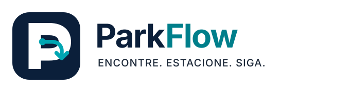

# Identidade visual do ParkFlow

## Marca

**Nome:** ParkFlow 
**Nome completo:** ParkFlow — Sistema Inteligente de Gestão de Estacionamentos 
**Slogan:** “Encontre. Estacione. Siga.”

O nome combina `Park`, referência ao estacionamento, e `Flow`, ideia de fluxo contínuo e operação organizada. O símbolo une três sinais: a letra **P**, um percurso ciano terminado em seta (**fluxo**) e um ponto circular (**localização**). A linguagem é geométrica, sem carros ou elementos decorativos, para transmitir uma plataforma B2B tecnológica e confiável.

## Logo

### Assinatura principal

Símbolo, nome `ParkFlow` (`Park` em azul profundo e `Flow` em ciano) e slogan. É exibida no login, no menu lateral e no cabeçalho da área pública do MVP.

### Símbolo

Versão reduzida para espaços quadrados; no MVP é usada como favicon (`frontend/public/favicon.svg`).

## Paleta principal

| Papel | HEX | Uso no MVP |
|---|---|---|
| Azul ParkFlow | `#0B1F3A` | títulos, botões primários e destaques |
| Ciano Fluxo | `#00A6B2` | barras de ocupação, item ativo do menu e destaques gráficos |
| Ciano para texto | `#007F8B` | links, foco e textos em ciano |
| Azul Névoa | `#E8EEF7` | fundos suaves e seleção |
| Branco | `#FFFFFF` | superfícies principais |
| Grafite | `#1D2939` | texto corrido |
| Borda | `#D0D5DD` | bordas de cartões, campos e tabelas |

## Estados das vagas

| Estado | HEX | Sinal adicional |
|---|---|---|
| Livre | `#16803C` | ícone de círculo com confirmação e rótulo “Livre” |
| Ocupada | `#C43232` | círculo preenchido e rótulo “Ocupada” |
| Reservada | `#9A6700` | ícone de relógio e rótulo “Reservada” |
| Indisponível | `#667085` | ícone de bloqueio e rótulo “Indisponível” |

Erros usam `#B42318` com ícone de alerta; informações usam `#175CD3` com ícone de informação.

## Tipografia

**Inter** (fonte variável, `@fontsource-variable/inter`), com fallback para `Segoe UI`, `Roboto`, `Helvetica Neue`, `Arial` e `sans-serif`. Textos informativos não usam menos de 14 px.

## Acessibilidade e contraste

- Estados nunca dependem só da cor: sempre aparecem com ícone e rótulo em mapas, listas, gráficos e relatórios.
- Texto comum mantém contraste mínimo de 4,5:1; por isso o ciano `#00A6B2` fica restrito a elementos gráficos e textos em ciano usam `#007F8B`.
- O logo usa o texto alternativo “ParkFlow — Encontre. Estacione. Siga.”.
- A interface usa base de 8 px, raios de 8 px (controles) e 12 px (cartões), sombras discretas e nenhum gradiente.
